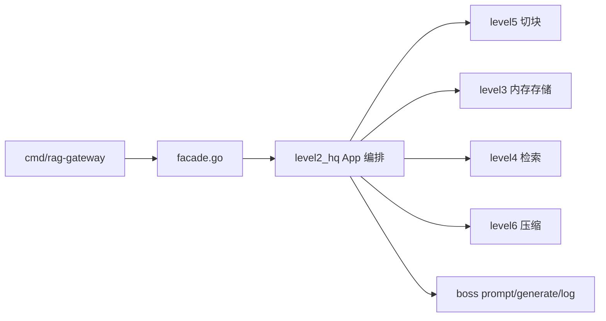

## 一、`internal/gateway` 快速大纲

### 这个项目在干什么

一个 **离线 RAG 最小闭环**：导入文档 → 切块 → 存知识库 → 检索 → 压缩 → 生成回答 → 写日志。

当前全部是 **模拟实现**，不连真实 Qdrant / Ollama / embedding，目的是先把**结构和接口**固定住。

### 分层（6 关 + Boss）



| 层 | 目录 | 模拟了什么 | 真实版将来换成 |
|---|---|---|---|
| 入口 | `facade.go` | 统一对外类型 | 不变 |
| 编排 | `level2_hq/app.go` | 串起整条链路 | 不变 |
| 契约 | `level1_world/types.go` | 请求/响应结构 | 不变 |
| 存储 | `level3_store` | 内存 slice，假装 Qdrant | Qdrant |
| 检索 | `level4_retrieval` | token 重叠算相似度 | 向量检索 |
| 切块 | `level5_chunking` | 按段落/标题切 | 更复杂 chunker |
| 压缩 | `level6_compression` | 去重、限量、截断 | 摘要压缩 |
| Boss | `boss/` | mock 回答 + JSONL 日志 | Ollama 等 |

### 怎么「模拟」——核心机制

`NewAppWithDeps(cfg, deps)` 是关键：每个组件都有 **interface**，不传就用默认 mock：

```33:94:internal/gateway/level2_hq/app.go
func NewAppWithDeps(cfg world.Config, deps AppDeps) *App {
	shared.MustMkdirAll(cfg.LogDir)
	shared.MustMkdirAll(cfg.DocDir)
	// ... 配置默认值 ...
	storeImpl := deps.Store
	if storeImpl == nil {
		storeImpl = store.NewMemoryKnowledgeStore()
	}
	// Retriever / PromptBuilder / Compressor / Generator / Logger 同理
}
```

| 接口 | 默认 mock | 作用 |
|---|---|---|
| `KnowledgeStore` | `MemoryKnowledgeStore` | 内存存 chunk，按相似度搜 |
| `Retriever` | `RetrievalService` | 标准化问题 + 调 store |
| `Compressor` | `SimpleCompressor` | 去重、限条数、限字数 |
| `PromptBuilder` | `StaticPromptBuilder` | 拼 prompt |
| `AnswerGenerator` | `MockAnswerGenerator` | 把命中内容拼成「根据知识库…」 |
| `ConversationLogger` | `JSONLConversationLogger` | 每轮 chat 写一行 JSON |

### 要达到什么结果（验收标准）

跑通后应能观察到：

1. **ingest**：文档被切块，存入内存，原文写到 `storage/docs/`
2. **debug/split**：只看切块，不入库
3. **debug/retrieval**：问题标准化后，返回命中的 chunk 和分数
4. **debug/prompt**：检索 → 压缩 → 拼出带 `[Relevant Knowledge]` 的 prompt
5. **chat**：有命中 → `UsedKnowledge: true`，回答引用知识；无命中 → 回退文案
6. **日志**：`storage/logs/` 下生成 JSONL，记录 session、问题、回答

测试文件 `boss/gateway_test.go` 就是这些行为的自动化验收。

### 最快上手路径

```bash
# 1. 跑测试（不启 HTTP）
go test ./internal/gateway/...

# 2. 启服务
go run ./cmd/rag-gateway

# 3. 按 README 顺序 curl：ingest → debug/retrieval → chat
```

=======================

`internal/gateway` 下 **16 个 Go 文件**已全部加上中文逐行/逐块注释，测试全部通过。

## 注释顺序（建议阅读路径）

| 顺序 | 文件 | 内容 |
|------|------|------|
| 1 | `level1_world/types.go` | 配置、HTTP 契约、内部知识块结构 |
| 2 | `shared/util.go` | `os.MkdirAll`、截断、去重等工具 |
| 3 | `level2_hq/ports.go` | 6 个可替换接口 + `AppDeps` |
| 4 | `level2_hq/app.go` | 主编排：NewApp、Ingest、Chat 等 |
| 5 | `level3_store/store_memory.go` | 内存知识库模拟 Qdrant |
| 6 | `level4_retrieval/retrieval.go` | 标准化、分词、相似度算法 |
| 7 | `level4_retrieval/retrieval_service.go` | 检索服务收口 |
| 8 | `level5_chunking/chunker.go` | 文档切块 |
| 9 | `level6_compression/compressor.go` | 去重/限量/截断 |
| 10 | `boss/prompt.go` | prompt 三段拼接 |
| 11 | `boss/generator_mock.go` | mock 回答 |
| 12 | `boss/logging.go` | JSONL 日志 |
| 13 | `facade.go` | 对外统一入口 |
| 14–16 | `*_test.go` | 各测试在验什么 |

## 注释风格说明

- **包级注释**：说明这一层在整条链路里的角色
- **类型/字段**：每个 struct 字段都有含义（含 `json` 标签用途）
- **函数**：说明入参、返回值、在 HTTP 链路里对应哪个接口
- **关键行**：标准库调用会解释（如 `os.MkdirAll`、`O_APPEND`、`0o755`）
- **测试**：每个 `Test*` 开头说明「在验证什么行为」

从 `level1_world/types.go` 顺着往下读，就能跟着注释走完整条 RAG 模拟链路。`cmd/rag-gateway/main.go` 不在本次范围里；需要的话也可以同样加注释。