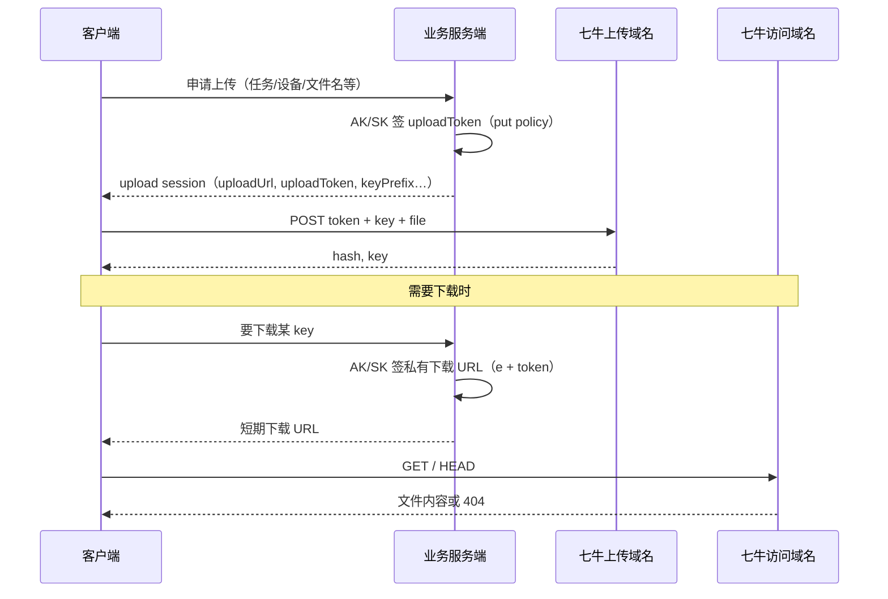

# 01 — 概念与总流程

## 一句话

- **上传**：客户端拿服务端签发的 **uploadToken**，向**上传域名** POST 表单（`token` + `key` + `file`）。
- **下载 / 访问**：客户端拿服务端签发的 **私有下载 URL**（`e` + `token`），向**访问域名** GET（或 HEAD）。

两套 token **不能混用**。

---

## 三类域名（最容易混）

| 类型 | 示例 | 用途 | HTTP 方法 |
|------|------|------|-----------|
| 上传域名 | `https://up-z2.qiniup.com` | 接收文件上传 | POST（multipart） |
| 访问 / 下载域名 | `https://bizdl.airdroid.com` | 读已上传对象 | GET / HEAD |
| 错误用法 | 用上传域名做下载 | 常 405 / 401，HEAD 还可能误判 | — |

上传域名与 bucket **机房**必须一致（华南 bucket 用 `up-z2`，华东常用 `upload.qiniup.com`）。  
访问域名必须在七牛控制台**绑定到对应 bucket**（例如 `bizdl-airdroid-com` → `bizdl.airdroid.com`）。

---

## 端到端流程

---

## 两种 token 对比

| | 上传 uploadToken | 下载签名（URL 参数） |
|--|------------------|----------------------|
| 形式 | `AK:sign:encoded_policy`（三段冒号） | `?e=deadline&token=AK:sign` |
| 谁生成 | 服务端（`qiniu_prefix_uptoken.py`） | 服务端（`qiniu_check_object_exists.py --private` 等） |
| 客户端是否持 SK | **否**，只拿 uploadToken | **否**，只拿带签名的 URL |
| 策略内容 | scope、deadline、isPrefixalScope、fsizeLimit… | 对「完整访问 URL（含 e）」做 HMAC-SHA1 |
| 有效期 | policy 里 `deadline` | URL 里 `e`（Unix 秒） |

---

## key 与「公开」

- **key**：对象在 bucket 内的路径，例如 `videos/task123/device456/滴滴电子发票.pdf`。
- **仅有 key 不够访问**：还需要**绑定到该 bucket 的访问域名**。
- **私有空间**：还必须带 `e` 与 `token`，否则 401；**不是**「知道 key 就能随便下」。
- **公开空间**：`访问域名 + key` 即可 GET，无需 token（生产少见）。

---

## 本仓库脚本分工

| 阶段 | 脚本 | 是否需要 AK/SK |
|------|------|----------------|
| 签发上传 | `qiniu_prefix_uptoken.py` | 是（仅服务端） |
| 执行上传 | `upload_local_directory_to_qiniu.py` | 否（用 session） |
| 签发下载 URL | `qiniu_check_object_exists.py --private` | 是 |
| 执行下载 | `qiniu_download_object.py --private` | 是（或复用已签 URL） |

AK/SK **只应出现在服务端或本地调试环境**，不要写进前端安装包。
