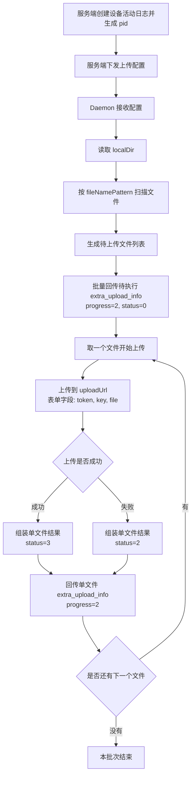
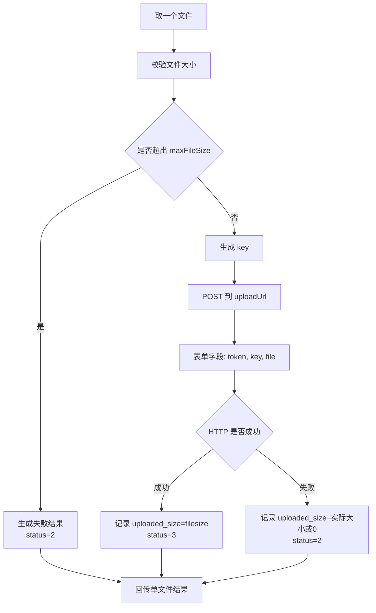

# 手机端 Daemon 上传流程图

这份文档给手机端 daemon 使用。

目的：

- 用流程图说明整个上传链路
- 让 daemon 清楚每一步该做什么
- 对照 [mobile_upload_integration.md](./mobile_upload_integration.md) 和 [mobile_upload_report_to_server.md](./mobile_upload_report_to_server.md) 实现

---

## 1. 总流程

---

## 2. Daemon 视角步骤

### 第 1 步：接收服务端下发配置

Daemon 需要拿到这些内容：

- `pid`
- `uploadUrl`
- `uploadToken`
- `keyPrefix`
- `localDir`
- `fileNamePattern`

如果有这些限制，也一起使用：

- `constraints.maxFileSize`

---

### 第 2 步：扫描本地目录

Daemon 要做：

1. 读取 `localDir`
2. 扫描目录中的文件
3. 用 `fileNamePattern` 过滤
4. 生成最终待上传列表

每个文件至少先准备这些信息：

- `filename`
- `path`
- `key`
- `filesize`
- `file_type`
- `cloud_type=q`
- `status=0`

其中：

- `key = keyPrefix + 文件名`

---

## 3. 扫描后批量回传

扫描完成后，daemon 先批量回传一次待执行列表。

外层固定：

- `pid`
- `progress=2`

每个文件：

- `status=0`

流程图：

---

## 4. 单文件上传流程

每个文件上传时，daemon 按下面流程执行。

---

## 5. 单文件回传内容

每上传完一个文件，都要回传一次结果。

外层固定：

- `pid`
- `progress=2`

文件字段：

- `filename`
- `path`
- `key`
- `filesize`
- `uploaded_size`
- `status`
- `upload_time`
- `cost_time`
- `error_info`
- `file_type`
- `cloud_type`
- `error_code`
- `uploadToken`

状态含义：

- `0`：待执行
- `1`：执行中
- `2`：失败
- `3`：成功

---

## 6. 成功 / 失败判定

### 成功

满足以下条件可视为成功：

- 上传接口返回成功
- 服务端 / 七牛返回有效结果

此时：

- `status=3`
- `error_code=0`
- `error_info=""`
- `uploaded_size=filesize`

### 失败

以下情况视为失败：

- token 失效
- 文件过大
- 网络失败
- 接口返回非成功状态

此时：

- `status=2`
- `error_code` 传实际错误码
- `error_info` 传实际错误信息

---

## 7. Daemon 实现重点

Daemon 只要记住下面这条主线：

1. 接收服务端配置
2. 扫描目录
3. 批量回传待执行列表
4. 逐个文件上传
5. 每个文件上传后立即回传结果
6. 全程外层 `progress` 固定传 `2`

---

## 8. 一句话版本

可以把整个流程理解成：

“服务端先给 daemon 一个 `pid + 上传配置`，daemon 先扫描目录并批量上报待执行文件，再逐个上传到七牛，并在每个文件完成后单独回传结果。”
