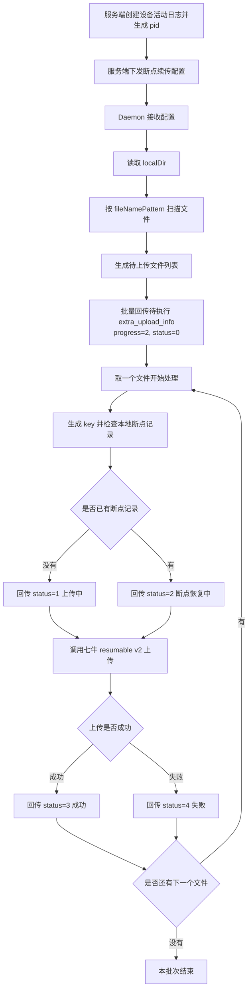
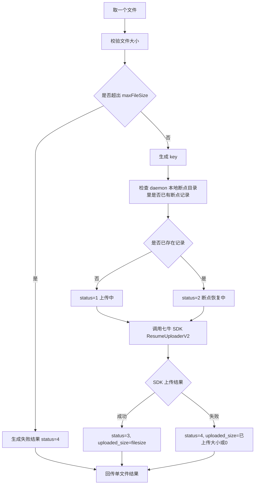

# 手机端 Daemon 断点续传流程图

这份文档给手机端 daemon 使用。

目的：

- 用流程图说明断点续传版完整链路
- 让 daemon 清楚每一步该做什么
- 对照 `resumable/` 下的接入文档和回传文档实现

---

## 1. 总流程

---

## 2. Daemon 视角步骤

### 第 1 步：接收服务端下发配置

Daemon 需要拿到这些内容：

- `pid`
- `bucketName`
- `uploadToken`
- `uploadHost`
- `keyPrefix`
- `localDir`
- `fileNamePattern`
- `constraints.maxFileSize`

---

### 第 2 步：扫描本地目录

Daemon 要做：

1. 读取 `localDir`
2. 扫描目录中的文件
3. 用 `fileNamePattern` 过滤
4. 校验文件大小
5. 生成待上传列表

每个文件先准备这些信息：

- `filename`
- `path`
- `key`
- `filesize`
- `uploaded_size=0`
- `file_type`
- `cloud_type=q`
- `status=0`
- `is_resumed=0`

---

## 3. 扫描后批量回传

扫描完成后，daemon 先批量回传一次待执行列表。

外层固定：

- `pid`
- `progress=2`

文件字段：

- `status=0`
- `uploaded_size=0`

流程图：

---

## 4. 单文件断点续传流程

---

## 5. 断点续传时实际发生了什么

daemon 在上传一个文件时，实际会做这些事：

1. 读取文件基础信息
2. 生成 `key`
3. 查找本地断点记录
4. 如果存在断点记录，进入恢复上传
5. 如果不存在，进入新上传
6. 调用七牛分片上传 v2
7. 中途中断时保留本地续传记录
8. 重启后继续从断点恢复
9. 上传完成后回传最终结果

---

## 6. 单文件回传内容

每上传一个文件，daemon 至少回传：

- `filename`
- `path`
- `key`
- `filesize`
- `uploaded_size`
- `status`
- `upload_time`
- `cost_time`
- `error_info`
- `file_type`
- `cloud_type`
- `error_code`
- `uploadToken`
- `is_resumed`

状态含义：

- `0`：待执行
- `1`：上传中
- `2`：断点恢复中
- `3`：成功
- `4`：失败

---

## 7. Daemon 实现重点

Daemon 只要记住下面这条主线：

1. 接收服务端配置
2. 扫描目录
3. 批量回传待执行列表
4. 逐个文件检查断点记录
5. 调用七牛分片上传 v2
6. 每个文件上传后立即回传结果
7. 外层 `progress` 始终传 `2`

---

## 8. 一句话版本

“服务端给 daemon 一份断点续传配置，daemon 先扫描目录并批量上报待执行文件，再按文件检查本地断点记录，使用七牛 resumable v2 上传，并在每个文件完成后单独回传结果。”
